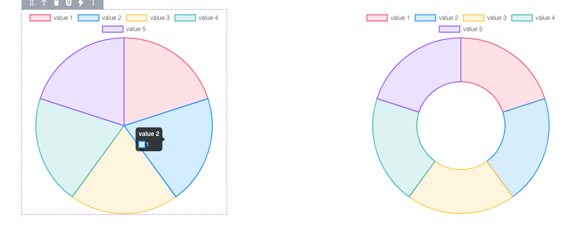
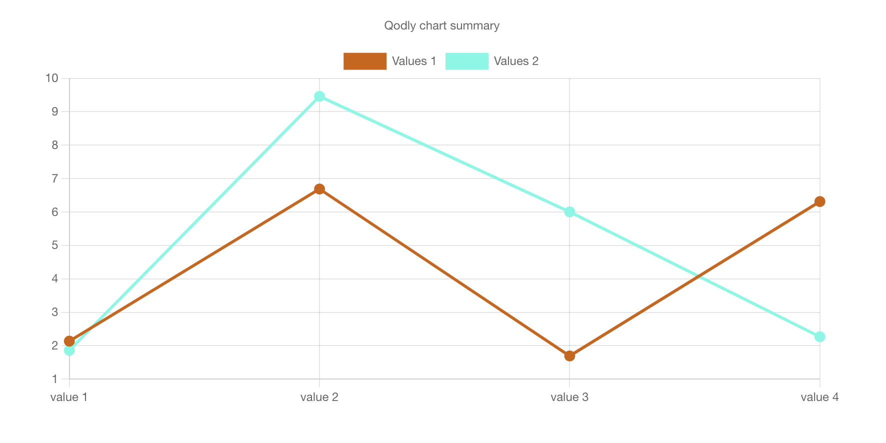
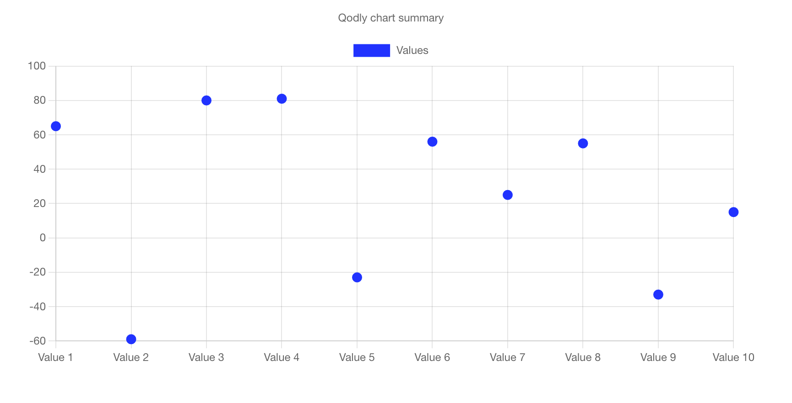
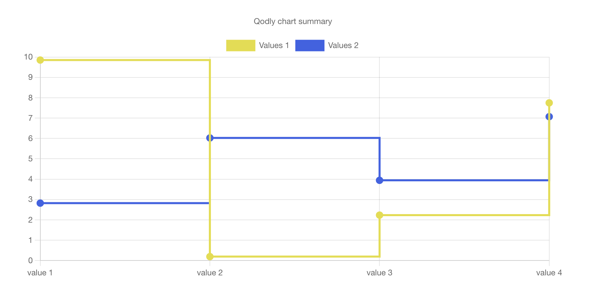
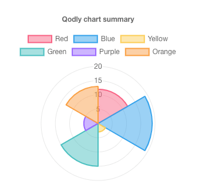
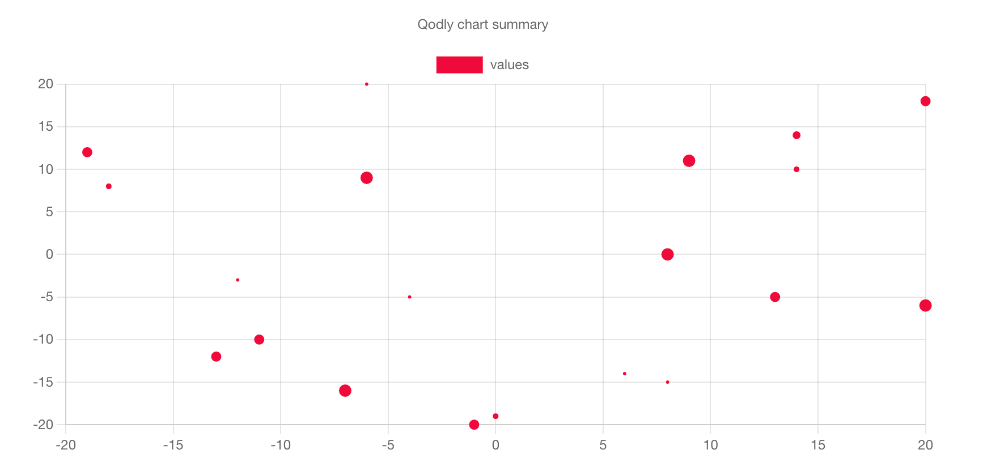
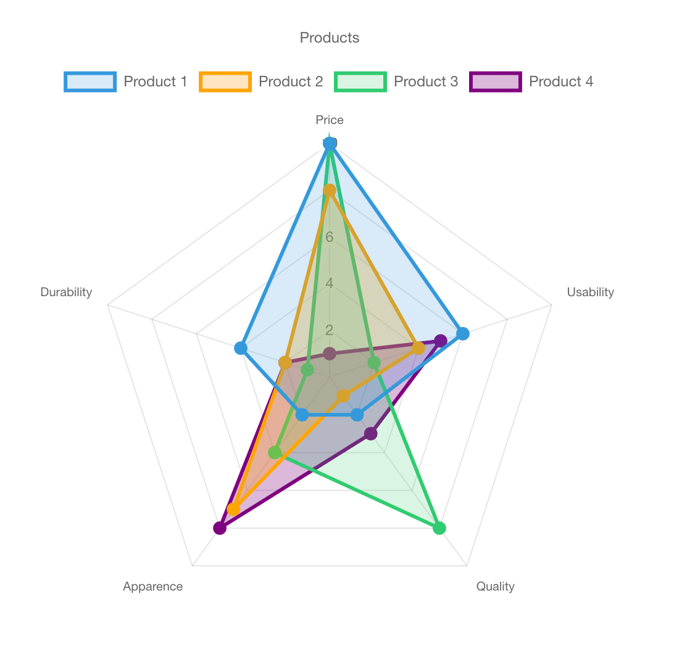
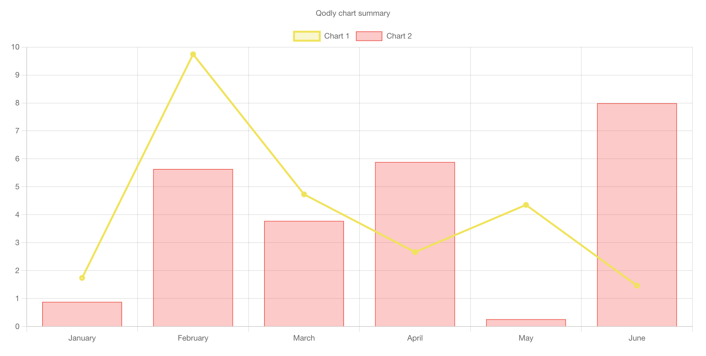

# Overview

Chart Component for Qodly studio using [ChartJS](https://www.chartjs.org/)

## Pie & Doughnut Chart

Pie and doughnut charts are probably the most commonly used charts. They are divided into segments, the arc of each segment shows the proportional value of each piece of data.

They are excellent at showing the relational proportions between data.

Pie and doughnut charts are the same, but have one different default value - their cutout. This equates to what portion of the inner should be cut out. This defaults to 0 for pie charts, and `50` for doughnuts.



| Name              | Type    | Description                                                                                                                                                                                                                  |
| ----------------- | ------- | ---------------------------------------------------------------------------------------------------------------------------------------------------------------------------------------------------------------------------- |
| `DataSource`      | Array   | The dataSource that contains data to display.                                                                                                                                                                                |
| `Title`           | String  | The Chart Title.                                                                                                                                                                                                             |
| `Legend Position` | String  | Defines the position of legend and can be one of the following values: `top`, `bottom`, `left`,`right`,`center`,`chartArea`,`hidden`, The default value is `top`, which means the legend will displayed on Tap of the chart. |
| `Cut Out`         | Number  | The portion of the chart that is cut out of the middle. It's considered to be pixels. if it's > 0 the Pie Chart become Doughnut Chart.                                                                                       |
| `Display tooltip` | Boolean | If set to `false` the tooltip won't appear                                                                                                                                                                                   |
| `Color`           | Array   | A set of colors that can be used in the pie chart                                                                                                                                                                            |

#### DataSource

| Name               | Attribut    | Type   | Required | Description                                                          |
| ------------------ | ----------- | ------ | -------- | -------------------------------------------------------------------- |
| `Label`            | label       | String | Yes      | The label for the dataset which appears in the legend and tooltips.  |
| `Value`            | value       | Number | Yes      | The value for the dataset.                                           |
| `Background Color` | color       | Color  | No       | The line fill color. If it's empty, a random color is generated      |
| `Border Color`     | borderColor | Color  | No       | The line color. if it's empty it will take background color instead. |

Some example of data that can be used :

```Json
[{"label": "Title", "value": 10}, ...]

[{"label": "Title", "value": 10, "color": "#84a0d0"}, ...]

[{"label": "Title", "value": 10, "color": "#84a0d0", "borderColor": "red"}, ...]
```

## Line Chart

A line chart is a way of plotting data points on a line. Often, it is used to show trend data, or the comparison of two data sets.



#### Properties

| Name              | Type     | Description                                                                                                                                                                    |
| ----------------- | -------- | ------------------------------------------------------------------------------------------------------------------------------------------------------------------------------ |
| `DataSource`      | Array    | The data source containing information to be displayed in the chart.                                                                                                           |
| `Title`           | String   | The title of the chart.                                                                                                                                                        |
| `Legend Position` | String   | Specifies the legend's position. Possible values: `top`, `bottom`, `left`, `right`, `center`, `chartArea`, `hidden`. Default is `top`. The legend appears on tap of the chart. |
| `Display Grid`    | Boolean  | If set to `false`, the grid lines on the chart will disappear.                                                                                                                 |
| `Display Tooltip` | Boolean  | If set to `false`, tooltips providing additional information won't appear.                                                                                                     |
| `Data`            | DataType | Contains properties for configuring chart series.                                                                                                                              |
| `Display X-Axis`  | Boolean  | If set to `false`, the x-axis will be hidden.                                                                                                                                  |
| `Display Y-Axis`  | Boolean  | If set to `false`, the y-axis will be hidden.                                                                                                                                  |

#### DataType

| Name               | Type    | Required | Description                                                                                                                                        |
| ------------------ | ------- | -------- | -------------------------------------------------------------------------------------------------------------------------------------------------- |
| `Label`            | String  | No       | The label for the dataset, visible in the legend and tooltips.                                                                                     |
| `Source`           | String  | Yes      | The attribute name used to map data from the DataSource.                                                                                           |
| `Background Color` | Color   | No       | The fill color for the line. If empty, a random color is generated.                                                                                |
| `Border Color`     | Color   | No       | The color of the line. If empty, it takes the background color.                                                                                    |
| `Point Color`      | Color   | No       | The fill color for points. If empty, it takes the background color.                                                                                |
| `Point Styles`     | Color   | No       | Style of the points. Possible values: `circle`, `cross`, `crossRot`, `dash`, `line`, `rect`, `rectRounded`, `rectRot`, `star`, `triangle`, `none`. |
| `Point Size`       | String  | No       | The radius of the point shape. If set to 0, the point is not rendered. Default is `5`.                                                             |
| `Tension`          | Number  | No       | Bezier curve tension of the line. Set to 0 for straight lines. Default is `0`. Example: `0.3`.                                                     |
| `Fill`             | Boolean | No       | If `true`, the line chart becomes an Area chart.                                                                                                   |
| `Stepped`          | Boolean | No       | If `true`, the line chart becomes a Stepped Line chart.                                                                                            |

#### DataSource

```json
[{"x": "Value 1", "y": 10}, {"x": "Value 2", "y": 25}, ...]

[{"x": "Value 1", "y": 10, "z": 20}, {"x": "Value 2", "y": 25, "z": 40}, ...]

[{"x": "Value 1", "source1": 10, "source2": 20, ...}, {"x": "Value 2", "source1": 25, "source2": 40, ...}, ...]

```

- `y, z, source1, source2 will be used in the source field to map data`

### Area Chart

Area Charts are based on line charts with `fill` set to `true`. Additionally, you should set the background color.


### Scatter Chart

Scatter charts are based on basic line charts with the x-axis changed to a linear axis. To use a scatter chart, set the data's border color to transparent.



### Stepped Chart

Stepped Charts are line charts in which points are connected by horizontal and vertical line segments, resembling the steps of a staircase. Step line charts are used to emphasize the irregularity of changes.



## Polar Area Chart

Polar area charts are similar to pie charts, but each segment has the same angle - the radius of the segment differs depending on the value.

This type of chart is often useful when we want to show a comparison data similar to a pie chart, but also show a scale of values for context.


#### Properties

| Name              | Type     | Description                                                                                                                                                                                                                         |
| ----------------- | -------- | ----------------------------------------------------------------------------------------------------------------------------------------------------------------------------------------------------------------------------------- |
| `DataSource`      | Array    | The dataSource that contains data to display.                                                                                                                                                                                       |
| `Title`           | String   | The Chart Title.                                                                                                                                                                                                                    |
| `Legend Position` | String   | Defines the position of the legend and can be one of the following values: `top`, `bottom`, `left`,`right`,`center`,`chartArea`,`hidden`. The default value is `top`, which means the legend will be displayed on tap of the chart. |
| `Display Grid`    | Boolean  | If set to `false`, the grid will disappear.                                                                                                                                                                                         |
| `Display Tooltip` | Boolean  | If set to `false`, the tooltip won't appear.                                                                                                                                                                                        |
| `Display Ticks`   | Boolean  | If set to `false`, the ticks between grid lines will disappear.                                                                                                                                                                     |
| `Tooltip Label`   | Boolean  | If set to `false`, the label in the tooltip won't appear.                                                                                                                                                                           |
| `Colors`          | DataType | Contains the colors for the polar chart.                                                                                                                                                                                            |
| `Suggested Min`   | Number   | The suggested minimum value for the axis.                                                                                                                                                                                           |
| `Suggested Max`   | Number   | The suggested maximum value for the axis.                                                                                                                                                                                           |
| `Suggested Step`  | Number   | The suggested step size between ticks on the axis.                                                                                                                                                                                  |

#### DataSource

| Name               | Attribut    | Type   | Required | Description                                                          |
| ------------------ | ----------- | ------ | -------- | -------------------------------------------------------------------- |
| `Label`            | label       | String | Yes      | The label for the dataset which appears in the legend and tooltips.  |
| `Value`            | value       | Number | Yes      | The value for the dataset.                                           |
| `Background Color` | color       | Color  | No       | The line fill color. If it's empty, a random color is generated      |
| `Border Color`     | borderColor | Color  | No       | The line color. if it's empty it will take background color instead. |

Some example of data that can be used :

```Json
[{"label": "Title", "value": 10}, ...]

[{"label": "Title", "value": 10, "color": "#84a0d0"}, ...]

[{"label": "Title", "value": 10, "color": "#84a0d0", "borderColor": "red"}, ...]
```

## Bar Chart

A bar chart provides a way of showing data values represented as vertical bars. It is sometimes used to show trend data, and the comparison of multiple data sets side by side


#### Properties

| Name              | Type     | Description                                                                                                                                                                    |
| ----------------- | -------- | ------------------------------------------------------------------------------------------------------------------------------------------------------------------------------ |
| `DataSource`      | Array    | The data source containing information to be displayed in the chart.                                                                                                           |
| `Title`           | String   | The title of the chart.                                                                                                                                                        |
| `Legend Position` | String   | Specifies the legend's position. Possible values: `top`, `bottom`, `left`, `right`, `center`, `chartArea`, `hidden`. Default is `top`. The legend appears on tap of the chart. |
| `Orientation`     | String   | The orientation of the bar chart. Possible values: `Vertical` or `Horizontal`.                                                                                                 |
| `Display Grid`    | Boolean  | If set to `false`, the grid lines on the chart will disappear.                                                                                                                 |
| `Display Tooltip` | Boolean  | If set to `false`, tooltips providing additional information won't appear.                                                                                                     |
| `Data`            | DataType | Contains properties for configuring chart series.                                                                                                                              |
| `Display X-Axis`  | Boolean  | If set to `false`, the x-axis will be hidden.                                                                                                                                  |
| `Display Y-Axis`  | Boolean  | If set to `false`, the y-axis will be hidden.                                                                                                                                  |
| `Stacked Bar`     | Boolean  | If set to `true`, the bars will be stacked. If set to ` false`, bars will be displayed side by side. Applicable only for bar charts.                                           |

#### DataType

| Name               | Type   | Required | Description                                                                                                                                                           |
| ------------------ | ------ | -------- | --------------------------------------------------------------------------------------------------------------------------------------------------------------------- |
| `Label`            | String | No       | The label for the dataset, visible in the legend and tooltips.                                                                                                        |
| `Source`           | String | Yes      | The attribute name used to map data from the DataSource.                                                                                                              |
| `Background Color` | Color  | No       | The fill color for the line. If empty, a random color is generated.                                                                                                   |
| `Border Color`     | Color  | No       | The color of the line. If empty, it takes the background color.                                                                                                       |
| `Border Width`     | Number | No       | The width of the line border. Default is `1`.                                                                                                                         |
| `Border Radius`    | Number | No       | The radius of the line border corners. Default is `0`.                                                                                                                |
| `Border Skipped`   | String | No       | Controls the rendering of line segments in the border. Possible values: 'Start', 'End', 'Middle', 'Bottom', 'Left', 'Top', 'Right', 'All', 'None'. Default is 'None'. |

#### DataSource

```json
[{"x": "Value 1", "y": 10}, {"x": "Value 2", "y": 25}, ...]

[{"x": "Value 1", "y": 10, "z": 20}, {"x": "Value 2", "y": 25, "z": 40}, ...]

[{"x": "Value 1", "source1": 10, "source2": 20, ...}, {"x": "Value 2", "source1": 25, "source2": 40, ...}, ...]

```

- `y, z, source1, source2 will be used in the source field to map data`

## Bubble Chart

A bubble chart is used to display three dimensions of data at the same time. The location of the bubble is determined by the first two dimensions and the corresponding horizontal and vertical axes. The third dimension is represented by the size of the individual bubbles.



#### Properties

| Name              | Type     | Description                                                                                                                                                                    |
| ----------------- | -------- | ------------------------------------------------------------------------------------------------------------------------------------------------------------------------------ |
| `DataSource`      | Array    | The data source containing information to be displayed in the chart.                                                                                                           |
| `Title`           | String   | The title of the chart.                                                                                                                                                        |
| `Legend Position` | String   | Specifies the legend's position. Possible values: `top`, `bottom`, `left`, `right`, `center`, `chartArea`, `hidden`. Default is `top`. The legend appears on tap of the chart. |
| `Display Grid`    | Boolean  | If set to `false`, the grid lines on the chart will disappear.                                                                                                                 |
| `Display Tooltip` | Boolean  | If set to `false`, tooltips providing additional information won't appear.                                                                                                     |
| `Data`            | DataType | Contains properties for configuring chart series.                                                                                                                              |
| `Display X-Axis`  | Boolean  | If set to `false`, the x-axis will be hidden.                                                                                                                                  |
| `Display Y-Axis`  | Boolean  | If set to `false`, the y-axis will be hidden.                                                                                                                                  |

#### DataType

| Name           | Type   | Required | Description                                                                                                                                        |
| -------------- | ------ | -------- | -------------------------------------------------------------------------------------------------------------------------------------------------- |
| `Label`        | String | No       | The label for the dataset, visible in the legend and tooltips.                                                                                     |
| `Source`       | String | Yes      | The attribute name used to map data from the DataSource.                                                                                           |
| `Color`        | Color  | No       | The fill color for points. If empty, a random color is generated.                                                                                  |
| `Border Color` | Color  | No       | The color of the line. If empty, it takes the color.                                                                                               |
| `Point Styles` | Color  | No       | Style of the points. Possible values: `circle`, `cross`, `crossRot`, `dash`, `line`, `rect`, `rectRounded`, `rectRot`, `star`, `triangle`, `none`. |

#### DataSource

```json
[{"x": "Value 1", "y": 10}, {"x": "Value 2", "y": 25}, ...]

[{"x": "Value 1", "y": 10, "z": 20}, {"x": "Value 2", "y": 25, "z": 40}, ...]

[{"x": "Value 1", "source1": 10, "source2": 20, ...}, {"x": "Value 2", "source1": 25, "source2": 40, ...}, ...]

```

- `y, z, source1, source2 will be used in the source field to map data`

## Radar Chart

A radar chart is a way of showing multiple data points and the variation between them.
They are often useful for comparing the points of two or more different data sets.



#### Properties

| Name              | Type     | Description                                                                                                                                                                                                                         |
| ----------------- | -------- | ----------------------------------------------------------------------------------------------------------------------------------------------------------------------------------------------------------------------------------- |
| `DataSource`      | Array    | The dataSource that contains data to display.                                                                                                                                                                                       |
| `Title`           | String   | The Chart Title.                                                                                                                                                                                                                    |
| `Legend Position` | String   | Defines the position of the legend and can be one of the following values: `top`, `bottom`, `left`,`right`,`center`,`chartArea`,`hidden`. The default value is `top`, which means the legend will be displayed on tap of the chart. |
| `Display Grid`    | Boolean  | If set to `false`, the grid will disappear.                                                                                                                                                                                         |
| `Display Ticks`   | Boolean  | If set to `false`, the ticks between grid lines will disappear.                                                                                                                                                                     |
| `Display Tooltip` | Boolean  | If set to `false`, the tooltip won't appear.                                                                                                                                                                                        |
| `Labels`          | DataType | Contains the labels for the radar.                                                                                                                                                                                                  |
| `Suggested Min`   | Number   | The suggested minimum value for the axis.                                                                                                                                                                                           |
| `Suggested Max`   | Number   | The suggested maximum value for the axis.                                                                                                                                                                                           |
| `Suggested Step`  | Number   | The suggested step size between ticks on the axis.                                                                                                                                                                                  |

#### DataSource

| Name                     | Attribute              | Type    | Required | Description                                                                                                                                   |
| ------------------------ | ---------------------- | ------- | -------- | --------------------------------------------------------------------------------------------------------------------------------------------- |
| `Label`                  | `label`                | String  | Yes      | The label for the dataset which appears in the legend and tooltips.                                                                           |
| `Data`                   | `data`                 | Array   | Yes      | The array of numerical values for the dataset.                                                                                                |
| `Background Color`       | `backgroundColor`      | Color   | No       | The line fill color. If it's empty, a random color is generated.                                                                              |
| `Border Color`           | `borderColor`          | Color   | No       | The line color. If it's empty, it will take the background color instead.                                                                     |
| `Point Background Color` | `pointBackgroundColor` | Color   | No       | The background color of the data points. If empty, it may use the line fill color.                                                            |
| `Point Border Color`     | `pointBorderColor`     | Color   | No       | The border color of the data points. If empty, it may use the line color.                                                                     |
| `Point Style`            | `pointStyle`           | String  | No       | Style of the data points. Allowed values: `circle`,`cross`,`crossRot`,`dash`,`line`,`rect`,`rectRounded`,`rectRot`,`star`,`triangle`, `none`. |
| `Point Radius`           | `pointRadius`          | Number  | No       | The radius of the data points.                                                                                                                |
| `Fill`                   | `fill`                 | Boolean | No       | If `true`, the area between the line and the x-axis will be filled. If `false`, it won't be filled.                                           |

Some example of data that can be used :

```Json
[{"label": "Title", "data": [10,6,2,2,4]}, ...]

[{"label": "Title", "data": [10,6,2,2,4], "backgroundColor": "#84a0d0"}, ...]

[{"label": "Title", "data": [10,6,2,2,4], "backgroundColor": "#84a0d0", "pointStyle": "star"}, ...]

[{"label": "Title", "data": [10,6,2,2,4], "backgroundColor": "#84a0d0", "pointRadius": 7}, ...]

[{"label": "Title", "data": [10,6,2,2,4], "backgroundColor": "#84a0d0", "fill": true}, ...]

[{"label": "Title", "data": [10,6,2,2,4], "backgroundColor": "#84a0d033", "borderColor": "#84a0d0", "pointBackgroundColor": "#84a0d0", "pointBorderColor": "#84a0d0", "pointStyle": "circle", "pointRadius": 3, "fill": true }, ...]
```

## Mixed Chart

A mixed chart combines different types of charts, such as bar charts, line charts, and scatter plots, within the same visualization. It enables users to represent diverse data sets and observe relationships between various data points in a single chart.



#### Properties

| Name                   | Type     | Description                                                                                                                                                                                                                         |
| ---------------------- | -------- | ----------------------------------------------------------------------------------------------------------------------------------------------------------------------------------------------------------------------------------- |
| `DataSource`           | Array    | The dataSource that contains data to display.                                                                                                                                                                                       |
| `Title`                | String   | The Chart Title.                                                                                                                                                                                                                    |
| `Legend Position`      | String   | Defines the position of the legend and can be one of the following values: `top`, `bottom`, `left`,`right`,`center`,`chartArea`,`hidden`. The default value is `top`, which means the legend will be displayed on tap of the chart. |
| `Charts`               | DataType | The chart to add.                                                                                                                                                                                                                   |
| `Display Grid`         | Boolean  | If set to `false`, the grid will disappear.                                                                                                                                                                                         |
| `Display Tooltip`      | Boolean  | If set to `false`, the tooltip won't appear.                                                                                                                                                                                        |
| `Display x-Axis Value` | Boolean  | If set to `false`, the x-Axis values will be hidden.                                                                                                                                                                                |
| `Display y-Axis Value` | Boolean  | If set to `false`, the y-Axis values will be hidden.                                                                                                                                                                                |
| `Stacked Bar`          | Boolean  | If set to `true`, the charts will be stacked.                                                                                                                                                                                       |

#### DataType

| Name               | Type    | Required | Description                                                                                                             |
| ------------------ | ------- | -------- | ----------------------------------------------------------------------------------------------------------------------- |
| `Label`            | String  | Yes      | The label for the dataset, visible in the legend and tooltips.                                                          |
| `Type`             | String  | Yes      | The type of the dataset. Possible values: "Line", "Bar", "Scatter", "Bubble", "Radar", "Pie", "Polar Area", "Doughnut". |
| `Source`           | String  | Yes      | The attribute name used to map data from the DataSource.                                                                |
| `Background Color` | Color   | No       | The fill color for the line. If empty, a random color is generated.                                                     |
| `Border Color`     | Color   | No       | The color of the line. If empty, it takes the background color.                                                         |
| `Border Width`     | Number  | No       | The width of the line border. If set to 0, the border is not rendered. Default is `1`.                                  |
| `Tension`          | Number  | No       | Bezier curve tension of the line. Set to 0 for straight lines. Default is `0`. Example: `0.3`.                          |
| `Fill`             | Boolean | No       | If `true`, for example the line chart becomes an Area chart.                                                            |

#### DataSource

TODO

Some example of data that can be used :

## TODO

- Support Dumbbell Chart
- Support Mixed chart
- Support Radialbar charts
